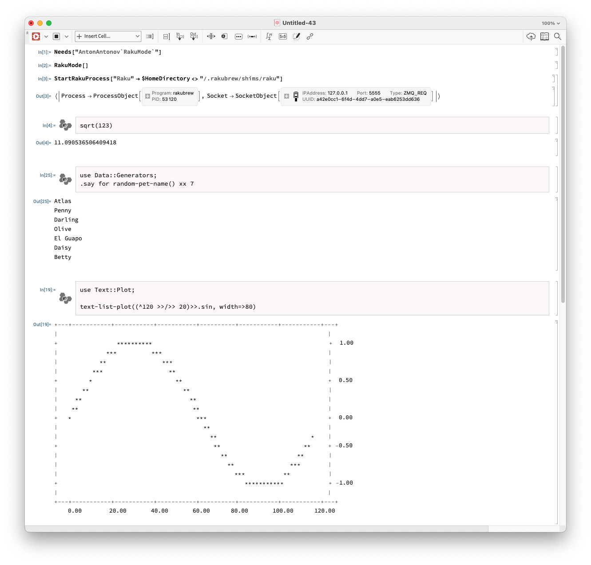
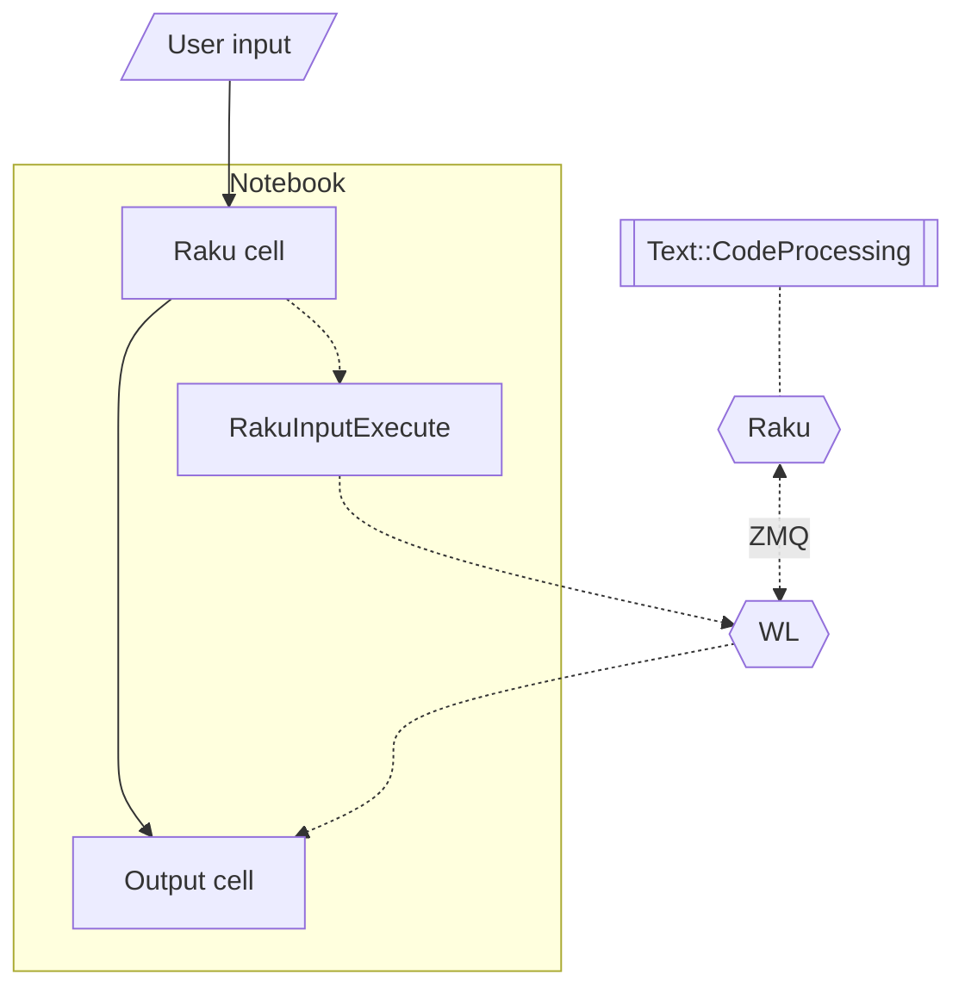

# RakuMode WL paclet

## Introduction

This repository has the code and documentation of Wolfram Language (WL) (aka Mathematica)
paclet that provides a notebooks style with
[Raku](https://raku.org)
external execution cells.

It is assumed that the user of this paclet has:

- Installed [Raku](https://rakudo.org)
- Installed the Raku module ["Text::CodeProcessing"](https://raku.land/zef:antononcube/Text::CodeProcessing), [AAp1]

## Installation

Install the
[paclet "RakuMode"](https://resources.wolframcloud.com/PacletRepository/resources/AntonAntonov/RakuMode/)
with the WL command:

```mathematica
PacletInstall["AntonAntonov/RakuMode"]
```

-----

## Getting completions (answers) and images

This screenshot should give a good idea of paclet's utility:



-----

## Flowchart

This flowchart shows the execution steps while using "RakuMode":



-----

## References

### Articles

[AA1] Anton Antonov,
["Connecting Raku with Wolfram Language and Mathematica"](https://community.wolfram.com/groups/-/m/t/2434981),
(2021),
[Community.wolfram.com](https://community.wolfram.com).

### Packages

[AAp1] Anton Antonov,
[Text::CodeProcessing Raku package](https://github.com/antononcube/Raku-Text-CodeProcessing),
(2021-2023),
[GitHub/antononcube](https://github.com/antononcube).
